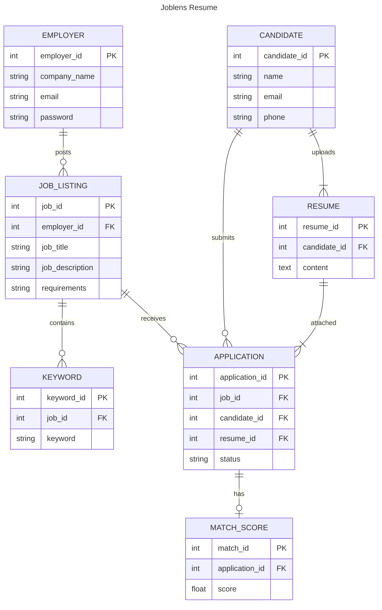

# JobLens

A University group project for the Object-Oriented Software Development Course

## Entity Relationship Diagram

```mermaid
---
title: Joblens Resume
---
erDiagram
    EMPLOYER {
        int employer_id PK
        string company_name
        string email
        string password
    }

    JOB_LISTING {
        int job_id PK
        int employer_id FK
        string job_title
        string job_description
        string requirements
    }

    CANDIDATE {
        int candidate_id PK
        string name
        string email
        string phone
    }

    RESUME {
        int resume_id PK
        int candidate_id FK
        text content
    }

    APPLICATION {
        int application_id PK
        int job_id FK
        int candidate_id FK
        int resume_id FK
        string status
    }

    KEYWORD {
        int keyword_id PK
        int job_id FK
        string keyword
    }

    MATCH_SCORE {
        int match_id PK
        int application_id FK
        float score
    }

    EMPLOYER ||--o{ JOB_LISTING : posts
    JOB_LISTING ||--o{ KEYWORD : contains
    JOB_LISTING ||--o{ APPLICATION : receives
    CANDIDATE ||--o{ APPLICATION : submits
    CANDIDATE ||--|{ RESUME : uploads
    RESUME ||--|{ APPLICATION : attached
    APPLICATION ||--o| MATCH_SCORE : has
```
