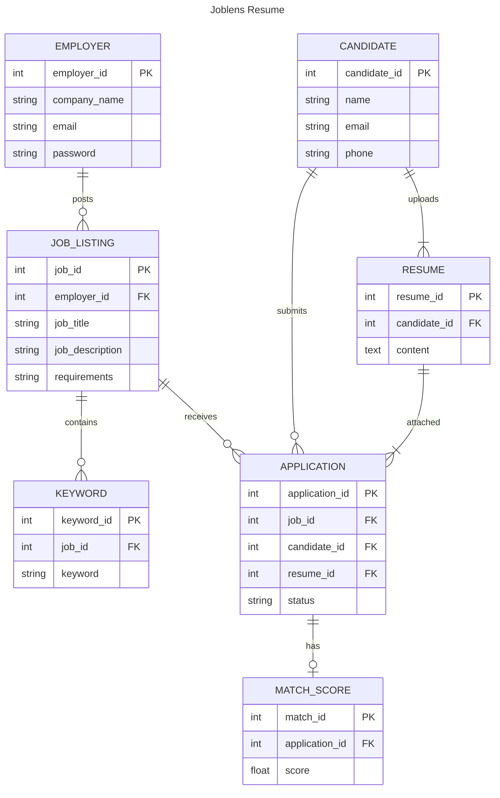

# RUNICE: Python Project

# JobLens

A University group project for the Object-Oriented Software Development Course

## How to Execute the Program

1. **Clone the repository:**
   `git clone https://github.com/rixnbix/JobLens.git`

2. **Navigate to the project directory:**
   `cd <project-directory>`

3. **Create a virtual environment:**
   `python -m venv joblens`

4. **Activate the virtual environment:**

   - For Windows:
     `joblens\Scripts\activate`
   - For macOS/Linux:
     `source joblens/bin/activate`

5. **Install the required dependencies:**
   `pip install -r requirements.txt`

6. **Run the application:**
   `python app.py`

## Entity Relationship Diagram

